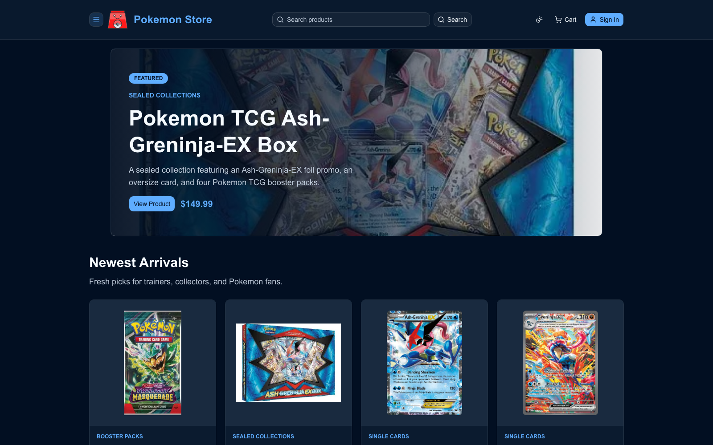
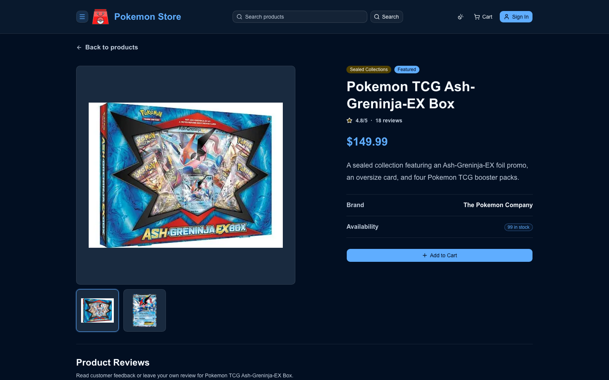
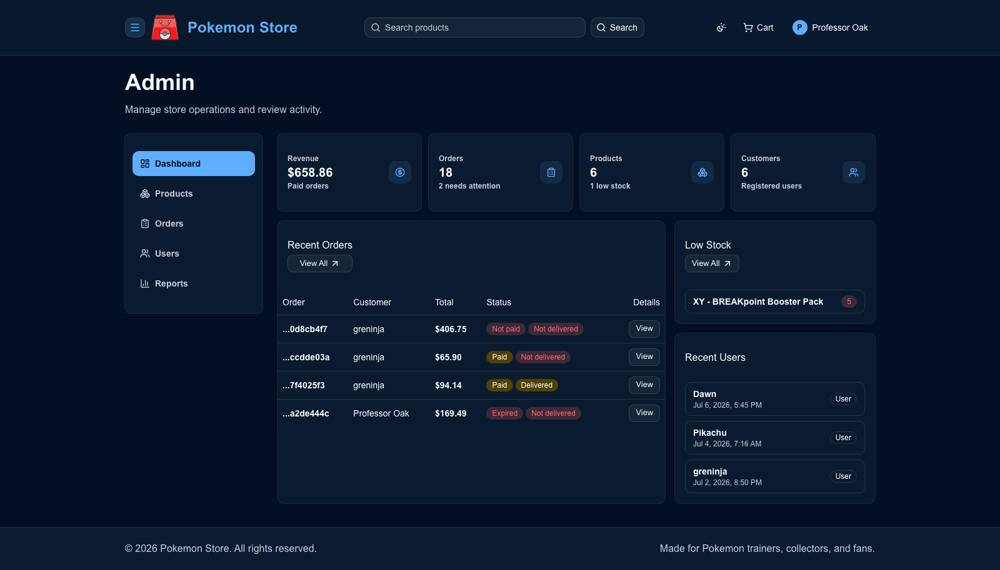

# Pokemon Store

A full-stack Pokemon TCG store built with Next.js, Prisma, PostgreSQL, NextAuth, Stripe, PayPal, UploadThing, Resend, shadcn/ui, and Tailwind CSS.

**Live Demo:** https://pokemon-store-pi.vercel.app/

## Features

- Storefront with carousel, product search, filtering, sorting, and pagination
- Product detail pages with image gallery, cart controls, and verified-purchase reviews
- Guest and signed-in cart support with cart merging after sign in
- Checkout flow with shipping, payment selection, place order, and order details
- Stripe, PayPal, and cash-on-delivery payments
- Order expiration for unpaid online orders with stock restoration
- Resend order receipt emails
- Customer profile and order history
- Admin dashboard, reports, products, orders, users, and image uploads

## Screenshots







## Tech Stack

- Next.js 15 App Router
- React 19
- TypeScript
- Prisma 7 with PostgreSQL
- NextAuth 5 beta
- Tailwind CSS 4
- shadcn/ui and Radix UI
- Stripe, PayPal, UploadThing, and Resend
- Jest and Testing Library

## Prerequisites

- Node.js compatible with Next.js 15 and React 19
- PostgreSQL database
- PayPal, Stripe, UploadThing, and Resend keys for the full payment/upload/email flows

## Quick Start

Create `.env` from the template and fill in at least `DATABASE_URL`, `AUTH_SECRET`, `NEXTAUTH_SECRET`, and `NEXT_PUBLIC_SERVER_URL`:

```bash
cp .env.example .env
```

Install dependencies, apply the database schema, seed sample data, and start the app:

```bash
npm install
npx prisma migrate dev
npx prisma db seed
npm run dev
```

Open:

```txt
http://localhost:3000
```

For the full setup, environment variables, database commands, and verification checklist, see `docs/setup.md`.

## Testing

```bash
npm run lint
npx tsc --noEmit
npm test -- --runInBand
npm run build
```

## Project Status

This project is feature-complete for a full-stack store. See `docs/roadmap.md` for implemented features and possible production improvements.

## Known Limitations

- Payment integrations should use sandbox/test keys until the store is ready for real transactions.
- Email sending requires a verified Resend sender/domain in production.
- Product image uploads require UploadThing configuration and allowed image hosts in `next.config.ts`.
- The app is a demo store and does not include fulfillment, refunds, shipment tracking, or tax/legal compliance workflows.

## Project Structure

```txt
app/                    Next.js routes
components/             Shared, admin, product, and UI components
db/                     Prisma client wrapper and seed data
docs/                   Detailed setup and provider notes
lib/action/             Server actions
prisma/                 Prisma schema and migrations
types/                  Shared app types
```

## Documentation

- `docs/setup.md` - local setup, commands, and environment variables
- `docs/database.md` - Prisma, migrations, and seed data
- `docs/deployment.md` - Vercel and production deployment notes
- `docs/paypal.md` - PayPal sandbox checkout
- `docs/stripe.md` - Stripe card payments and webhooks
- `docs/uploadthing.md` - product image uploads
- `docs/email.md` - Resend receipt emails
- `docs/roadmap.md` - current status and possible future work
